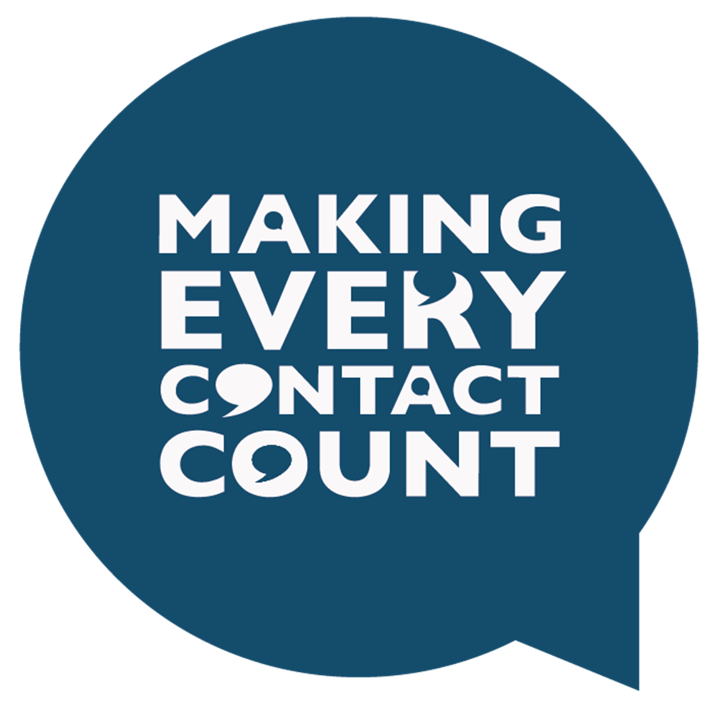
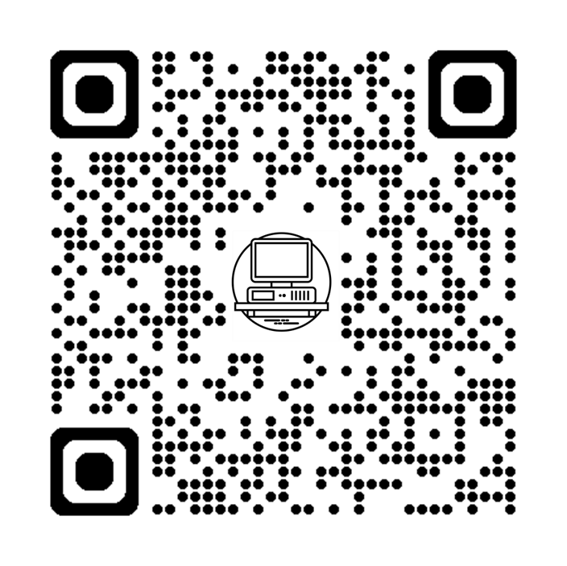

## Meet the Team
<!-- A brief intro to you and your role / organisation.  In particular, you should make mention of any prior coding / modelling / data science experience you had pre-HSMA (and if your experience was limited or non-existent, say that!  It’s fantastic for people to see how far you were able to come)
This project started as a Hackday for HSMA Cohort 6.
-->
. . .

- **Dominic Rowney** *Principle Information Analyst* at NHS NECS</br>
<p><span style="color:DarkGrey;">Dominic had dabbled in data science prior to the HSMA course, mainly using R and SQL. He now uses python to improve everyday tasks and looks for places where HSMA training can be implemented in his work</p></span>

. . .

- **Sam Vauntier** *Data Scientist* at Somerset NHS FT</br>
<p><span style="color:DarkGrey;">Before joining HSMA, Sam's coding experience was mostly in SQL, with very little python. She had no prior experience in modelling and had only recently transitioned into data science from a data engineering role within the Trust.</p></span>

. . .

- **Mr Luke Herbet** *Consultant Ophthalmologist* at Surrey & Sussex NHS Trust</br>
<p><span style="color:DarkGrey;">Luke is a retinal surgeon who learned python coding on the HSMA course and is also using his HSMA training to look at resource issues in ophthalmology.</p></span>

. . .

- With thanks to Sammi and Dan from PenChord for their support, and Richard Hall and Richard Harrety from NECS 

## What the MECC?
<!--What was the problem you were / are trying to solve, and why is it important?-->
**M**aking **E**vent **C**ontact **C**ount **(MECC)** in North East and North Cumbria is used across healthcare, local government, Department of Work & Pensions, charities, [etc.](https://www.meccgateway.co.uk/nenc/case-studies)

:::: {.columns}
::: {.column width="20%"} 
[{.r-nostretch fig-align="left"}](https://www.meccgateway.co.uk/nenc/about)
:::

::: {.column width="80%"} 
:::{style="color=#ddeaf1"}
> ❝ MECC is an approach to behaviour change that utilises the millions of day-to-day interactions that organisations and people have with other people to encourage changes in behaviour that have a positive effect on the health and wellbeing of individuals, communities and populations. ❞\
:::
:::
::::

. . .

- MECC interventions are difficult to study and the impact difficult to measure so we proposed a **simulation approach** to allow generation of evidence to support the implementation of MECC training.

. . .

- The simulation would need to be **simple** to use and to be **flexible** for use across the wide range of settings and delivery models MECC has.

## Agent Based Simulation
:::{.incremental}

:::: {.columns}
::: {.column width="70%"} 
- **Agent Based Simulation** (ABS) is a simulation method that focuses on the behaviours, interactions and motivations of individuals (agents), and observes the population-level emergent behaviour that arises from these individual behaviours and interactions.
:::
::: {.column width="30%"} 
{.r-nostretch fig-align="right"}
:::
::::
- The model allows the user to set a range of parameters and rules that control the likelihood of events occurring, the starting states of the agents, and their interactions
- Individuals within the starting population will proceed through the simulation and be subject to the chance of events occurring as they interact
- The model can be set to run for any number of steps or iterations
- In this case we use a python language package called **[Mesa](https://mesa.readthedocs.io/)** to create the underlying model and a **[Streamlit](https://streamlit.io/)** to create the interface
:::

## Development
:::{.incremental}
- Prototype models were developed as part of the HSMA hackday, a generic model and a smoking cessation model
- In January 2025 we tasked the regional MECC strategy group to prioritise themes and pathways and to start to map those out
- The top three thematic areas were **Alcohol**, Mental Health, and Smoking Cessation
- The plan was to start with a well-defined area in order to prototype: **Alcohol**
    + Mental Health was too complex and Smoking Cessation already high acceptance
- In May 2025 an alcohol intervention model was presented to the MECC regional team for feedback
:::


## Model Overview
<!--An overview of the model / tool you’ve built, appropriate for a non-technical audience (live demos of StreamLit apps / models can be very effective - just be mindful to have things set up ready to run and be prepared for technical issues)
{fig-align="center"}
-->
:::: {.columns}
::: {.column width="30%"} 
```{mermaid .incremental}

%%{init: {'theme':'neutral'}}%%

flowchart TB
 subgraph s1["Service"]
        C("Interaction")
  end
    A(("Population")) --> B("Person")
    B --> s1
    C --> D("Outcome")
    D --> E(("Population
    Change"))

```
:::
::: {.column width="70%"} 
::: {.incremental}
- The model consists of two types of agent: **People** and **Services**
- **People** have a chance of visiting services
- **Services** then have a chance of performing an intervention on people that visit, and can be MECC trained or not
- With MECC training the interventions can be more frequent and/or more efficacious
- Also includes:
  + a period where repeated interventions can have an additive effect
  + decay of efficacy of the MECC training
- The model is run **twice**, simultaneously, once with MECC training and once without. Results can then be compared.
:::
:::
::::

## Live Demo! 
{.r-stretch  fig-align="center"}

:::{style="text-align: center"}
**[Alcohol Intervention Toy MECC App](https://domrowney-project-toy-mecc-streamlit-appapp-alcohol-cqzaxu.streamlit.app/)**
:::

## Wider Impact 
<!--    a.	What are the key results coming out of your model, and what do they mean?-->
<!--a.	What impact has this work had - how is your organisation using this information?  What did they do?  Be as specific as possible.  If the impact has not yet happened, explain how they are going to be using this information, and what decisions etc it will feed into.  THIS IS A VITAL PART OF YOUR PRESENTATION.-->
:::{style="color=#ddeaf1"}
> ❝ *We were very impressed with your ability to convey some very complex concepts.  The model looks very promising, and we look forward to the next phase of development.* ❞
:::
:::{style="text-align: right"}
**Jill Harland, Regional MECC Team</br></br>**
:::

:::{.incremental}
- The model is still in the prototype stage, finding the correct ranges of variables to use. This is why it is described as a toy
- It can currently be used to show decision makers what level of interventions MECC would need to produce
- There has been some interest from the organisations part of the regional MECC strategy group for agent based modelling for MECC and other uses.
- Sammi developed a way for the app to produce report documents, which will be useful to HSMA and beyond
:::

## Next steps
:::{.incremental}
- Write up a board paper to deliver to the MECC group
- Find a specific test case to compare the model against reality
- Add a data report that outputs once the model runs
- Make a file that allows saving and importing of parameters
- Create a version of the model which includes parameters taken from randomised control trials of MECC
- Continue developing a *Monte-Carlo* version of the models, where it is run many times to achieve average results
- Make the list of services customisable
:::
<!--a.	Where it is now
b.	Future developments
c.	Impact / intended impact
d.	Lessons learnt-->

##  Personal Impact
<!--a.	What has been the impact of being part of HSMA on you and your organisation?  What does it mean to you to have developed these skills?  How is the organisation planning on using these new in-house skills moving forward?-->
:::{.incremental}
- NHS NECS has written up a case study as Agent Based Simulation is now a service they can offer to organisations
- A positive experience with creating an open source product
- Skills picked up have already been applied to other projects
:::

. . .

[{fig-align="center"}](https://hsma.co.uk/)

# Any Questions? {background-image="MECC_Logo_Washout.png" background-opacity="0.5" background-size="contain"}
